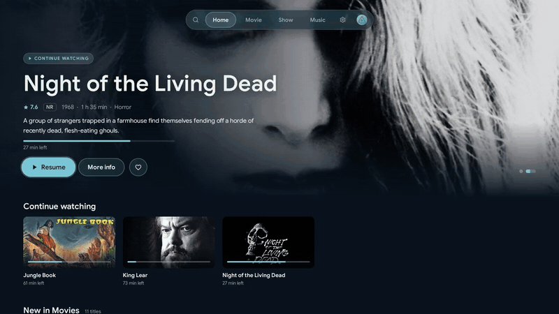

<p align="center">
  <picture>
    <source media="(prefers-color-scheme: dark)" srcset="website/assets/wordmark-dark.svg">
    
  </picture>
</p>

<p align="center">
  A Jellyfin client for Android TV, Google TV and Fire TV.
</p>

<p align="center">
  <a href="https://glacier-jellyfin.github.io/glacier-androidtv/">Website</a> ·
  <a href="https://github.com/Glacier-Jellyfin/glacier-androidtv/releases/latest">Download</a> ·
  <a href="CHANGELOG.md">Changelog</a>
</p>

<p align="center">
  
</p>

> [!NOTE]
> Glacier is young and still growing. If something does not work, please
> [report it](https://github.com/Glacier-Jellyfin/glacier-androidtv/issues).

## Features

- Movies, shows and music from your Jellyfin server, with search, sorting and
  filters, collections and an A–Z rail for large libraries
- Search that also finds titles missing from your library and requests them
  through Seerr (needs the Jellyfin Enhanced plugin on the server)
- Multiple servers and profiles, server discovery and Quick Connect. A start
  profile can open by itself
- Parental controls: age limits and PINs for profiles, titles and settings,
  stored only on the device
- A player made for watching: skip intros, recaps and credits, trickplay
  previews while seeking, chapters and "next episode" with a countdown
- The TV switches to the frame rate of the video, so films play without judder
- Extended audio codec support via FFmpeg (DTS, TrueHD and more) for more
  direct playback, and surround sound that stays surround over HDMI ARC
- Music that keeps playing while you browse, with a mini player, queue,
  playlists, lyrics, instant mix and music videos
- Local and YouTube trailers with subtitles, and theme songs on detail pages
- Audio and subtitle preferences synced with your Jellyfin account
- Android TV home screen: "Watch next" and three optional channels (not on
  Fire TV)
- English and German user interface, accent colours and a compact layout
- Diagnostics that send a cleaned error log to your server for bug reports
- Built-in updates from GitHub releases, with a Stable and a Beta channel

## Requirements

| | |
|---|---|
| Device | Android TV, Google TV or Fire TV running Android 9 (API 28) or newer |
| Server | Jellyfin 12.0 or newer |

## Installation

Glacier is free and needs no account. It is distributed only through
[GitHub releases](https://github.com/Glacier-Jellyfin/glacier-androidtv/releases).

### With Downloader (recommended)

1. Install the free [Downloader](https://www.aftvnews.com/downloader/) app from
   the app store on your TV.
2. Open Downloader and enter the code **2423112**.
3. Allow the install when Android asks. The code always loads the newest
   version.

### As an APK

Download
[`glacier-androidtv.apk`](https://github.com/Glacier-Jellyfin/glacier-androidtv/releases/latest/download/glacier-androidtv.apk)
and sideload it, for example with `adb install glacier-androidtv.apk`.

### Updates

Once installed, Glacier keeps itself up to date. It checks for new versions
at every start and installs them from GitHub releases. Android asks once for
permission to install updates from Glacier. You can pick the Stable or Beta
channel in Settings › System.

### Checking a download

Every release is built on GitHub from the source code in this repository and
carries a signed build provenance attestation. With the
[GitHub CLI](https://cli.github.com/) you can check that your APK came from
here:

```sh
gh attestation verify glacier-androidtv.apk --repo Glacier-Jellyfin/glacier-androidtv
```

## Building

Requirements: JDK 17 or newer and the Android SDK (Android Studio installs it).

```sh
./gradlew assembleDebug        # debug APK in app/build/outputs/apk/debug/
./gradlew testDebugUnitTest    # unit tests
```

See [docs/ARCHITECTURE.md](docs/ARCHITECTURE.md) for the module layout and
[docs/RELEASING.md](docs/RELEASING.md) for versioning and releases.

## How I build Glacier

Glacier is a hobby project. I work as a software developer, and next to my
job I use Glacier to find out how to build software together with AI.

I want to be open about what that means. Almost all code, tests and
documentation are written with
[Claude Code](https://claude.com/claude-code), Anthropic's coding assistant,
working together with me. Every commit it worked on says so with a
`Co-Authored-By: Claude` line, and today that is nearly every commit.

I decide what Glacier does and how it looks and feels. I review the changes
and test them on my own TVs and the Android TV emulator before they ship. On
top of that, every change goes through lint, unit tests and security scans in
CI, and releases are built only by GitHub from the public source code.

Glacier itself has no AI features and sends nothing to AI services. AI makes
mistakes, and so do I. If something looks wrong, please
[tell me](https://github.com/Glacier-Jellyfin/glacier-androidtv/issues).

## Contributing

Bug reports, ideas, pull requests and translations are welcome. Please read
[CONTRIBUTING.md](CONTRIBUTING.md) first.

## Support

Glacier is free and stays that way. If you'd like to support development, you can
[buy me a coffee on Ko-fi](https://ko-fi.com/jeansy91).

## License

Glacier is licensed under the [GNU General Public License v3.0 or later](LICENSE).

Glacier is an independent project and is not affiliated with the Jellyfin project.
