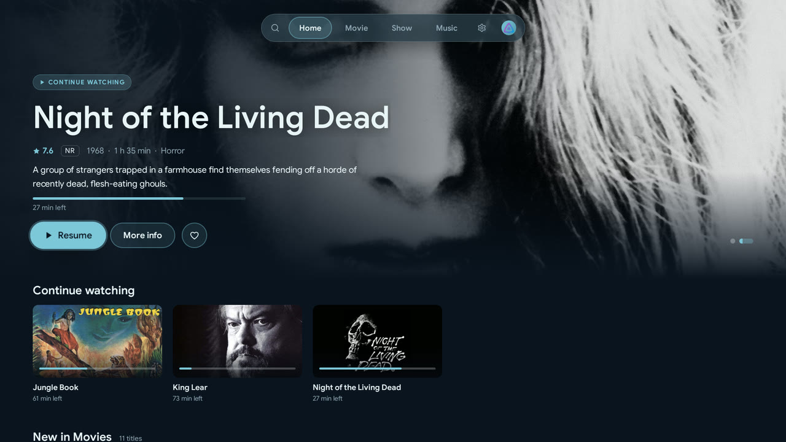

<p align="center">
  
</p>

<h1 align="center">Glacier</h1>

<p align="center">
  A Jellyfin client for Android TV, Google TV and Fire TV.
</p>

<p align="center">
  <a href="https://glacier-jellyfin.github.io/glacier-androidtv/">Website</a> ·
  <a href="https://github.com/Glacier-Jellyfin/glacier-androidtv/releases/latest">Download</a> ·
  <a href="CHANGELOG.md">Changelog</a>
</p>

<p align="center">
  
</p>

> [!NOTE]
> Glacier is in early development and released as public betas. Expect rough
> edges, and please [report what you find](https://github.com/Glacier-Jellyfin/glacier-androidtv/issues).

## Features

- Movies, shows and music from your Jellyfin server, with search, sorting and
  filters, collections and an A–Z rail for large libraries
- Multiple servers and profiles, server discovery, Quick Connect; a start
  profile can open by itself
- Parental controls: age limits and PINs for profiles, titles and settings,
  stored only on the device
- A player made for watching: skip intros, recaps and credits, trickplay
  previews while seeking, chapters and "next episode" with a countdown
- Extended audio codec support via FFmpeg (DTS, TrueHD and more) for more
  direct playback
- Music that keeps playing while you browse, with a mini player, queue,
  playlists, lyrics, instant mix and music videos
- Local and YouTube trailers, and theme songs on detail pages
- Audio and subtitle preferences synced with your Jellyfin account
- Android TV home screen: "Watch next" and three optional channels (not on
  Fire TV)
- English and German user interface, accent colours and a compact layout
- Diagnostics that send a cleaned error log to your server for bug reports
- Built-in updates from GitHub releases, with a Stable and a Beta channel

## Requirements

| | |
|---|---|
| Device | Android TV, Google TV or Fire TV running Android 9 (API 28) or newer |
| Server | Jellyfin 12.0 or newer |

## Installation

Glacier is distributed only through
[GitHub releases](https://github.com/Glacier-Jellyfin/glacier-androidtv/releases).
Download `glacier-androidtv-<version>.apk` from the latest release and sideload
it, for example with [Downloader](https://www.aftvnews.com/downloader/). Once
installed, Glacier keeps itself up to date; Android asks once for permission to
install updates from Glacier.

## Building

Requirements: JDK 17 or newer and the Android SDK (Android Studio installs it).

```sh
./gradlew assembleDebug        # debug APK in app/build/outputs/apk/debug/
./gradlew testDebugUnitTest    # unit tests
```

See [docs/ARCHITECTURE.md](docs/ARCHITECTURE.md) for the module layout and
[docs/RELEASING.md](docs/RELEASING.md) for versioning and releases.

## Contributing

Contributions are welcome. Please read [CONTRIBUTING.md](CONTRIBUTING.md) first.

## Support

Glacier is free and stays that way. If you'd like to support development, you can
[buy me a coffee on Ko-fi](https://ko-fi.com/jeansy91).

## License

Glacier is licensed under the [GNU General Public License v3.0 or later](LICENSE).

Glacier is an independent project and is not affiliated with the Jellyfin project.
